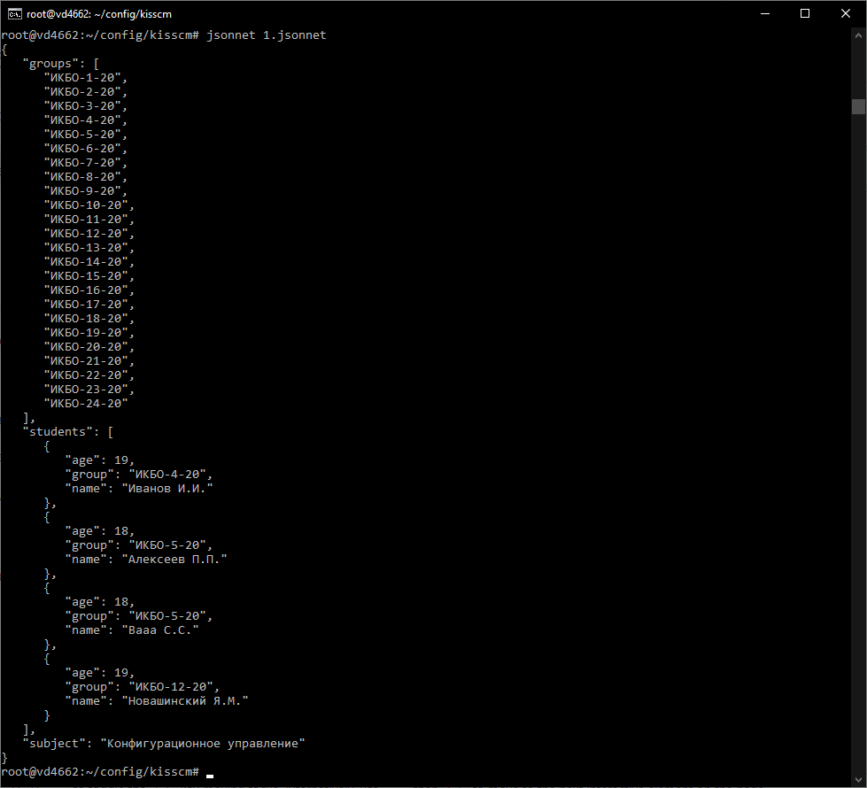
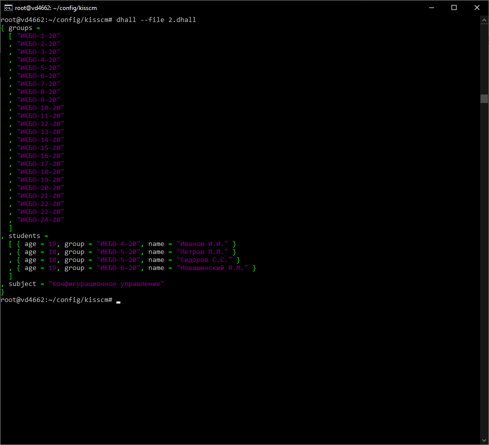
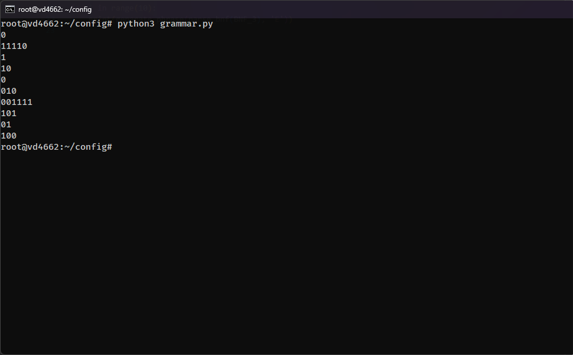
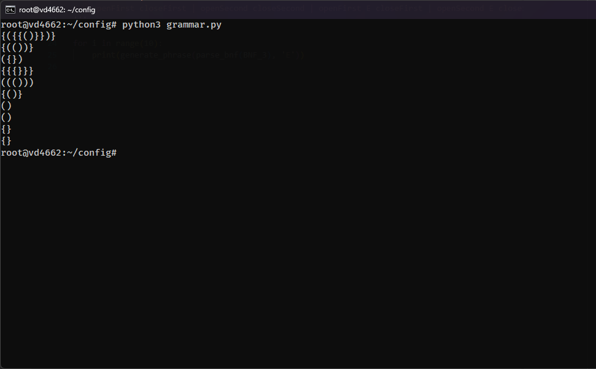
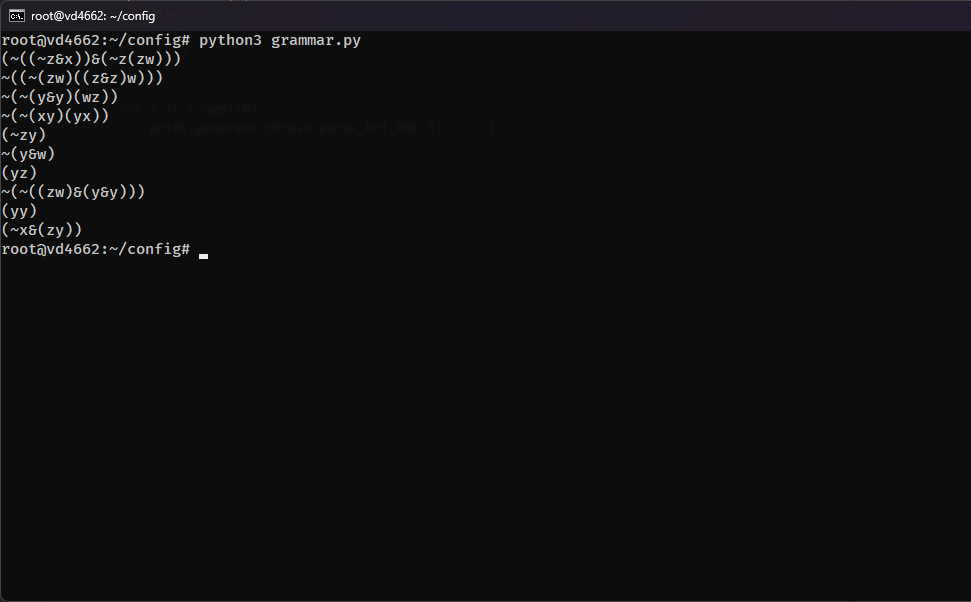

# Практическое занятие №3. Конфигурационные языки

П.Н. Советов, РТУ МИРЭА

Разобраться, что собой представляют программируемые конфигурационные языки (Jsonnet, Dhall, CUE).

## Задача 1

Реализовать на Jsonnet приведенный ниже пример в формате JSON. Использовать в реализации свойство программируемости и принцип DRY.

## Решение
```
local groupPrefix = 'ИКБО-';
local year = '-20';
local groupNum = std.range(1, 24);

local studentData = [
  {name: "Иванов И.И.", age: 19, groupIndex: 4},
  {name: "Алексеев П.П.", age: 18, groupIndex: 5},
  {name: "Вааа С.С.", age: 18, groupIndex: 5},
  {name: "Новашинский Я.М.", age: 19, groupIndex: 12}
];

{
  groups: [groupPrefix + std.toString(i) + year for i in groupNum],

  students: [
    {
      age: student.age,
      group: groupPrefix + std.toString(student.groupIndex) + year,
      name: student.name
    } for student in studentData
  ],

  subject: "Конфигурационное управление"
}
```


---
## Задача 2

Реализовать на Dhall приведенный ниже пример в формате JSON. Использовать в реализации свойство программируемости и принцип DRY.

```
{
  "groups": [
    "ИКБО-1-20",
    "ИКБО-2-20",
    "ИКБО-3-20",
    "ИКБО-4-20",
    "ИКБО-5-20",
    "ИКБО-6-20",
    "ИКБО-7-20",
    "ИКБО-8-20",
    "ИКБО-9-20",
    "ИКБО-10-20",
    "ИКБО-11-20",
    "ИКБО-12-20",
    "ИКБО-13-20",
    "ИКБО-14-20",
    "ИКБО-15-20",
    "ИКБО-16-20",
    "ИКБО-17-20",
    "ИКБО-18-20",
    "ИКБО-19-20",
    "ИКБО-20-20",
    "ИКБО-21-20",
    "ИКБО-22-20",
    "ИКБО-23-20",
    "ИКБО-24-20"
  ],
  "students": [
    {
      "age": 19,
      "group": "ИКБО-4-20",
      "name": "Иванов И.И."
    },
    {
      "age": 18,
      "group": "ИКБО-5-20",
      "name": "Петров П.П."
    },
    {
      "age": 18,
      "group": "ИКБО-5-20",
      "name": "Сидоров С.С."
    },
    <добавьте ваши данные в качестве четвертого студента>
  ],
  "subject": "Конфигурационное управление"
} 
```

## Решение
```
let Prelude = https://prelude.dhall-lang.org/v15.0.0/package.dhall
let Group = Text

let Student = { age : Natural, group : Group, name : Text }

let createGroup : Natural -> Group =
      λ(n : Natural) → "ИКБО-" ++ (Natural/show n) ++ "-20"

let groups =
      Prelude.List.generate
        24
        Text
        (λ(i : Natural) → createGroup (i + 1))

let createStudent : Natural -> Group -> Text -> Student =
      λ(age : Natural) → λ(group : Group) → λ(name : Text) →
        { age = age, group = group, name = name }

let students =
  [ createStudent 19 (createGroup 4) "Иванов И.И."
  , createStudent 18 (createGroup 5) "Петров П.П."
  , createStudent 18 (createGroup 5) "Сидоров С.С."
  , createStudent 19 (createGroup 6) "Новашинский Я.М."
  ]

let subject = "Конфигурационное управление"

let config = { groups = groups, students = students, subject = subject }

in config
```


---
Далее будут представлен код, который будет помещен в переменую ```BNF``` в следующем коде:
```python
import random

def parse_bnf(text):
    grammar = {}
    rules = [line.split('=') for line in text.strip().split('\n')]
    for name, body in rules:
        grammar[name.strip()] = [alt.split() for alt in body.split('|')]
    return grammar

def generate_phrase(grammar, start):
    if start in grammar:
        seq = random.choice(grammar[start])
        return ''.join([generate_phrase(grammar, name) for name in seq])
    return str(start)

BNF= '''
E = a
'''

for i in range(10):
    print(generate_phrase(parse_bnf(BNF), 'E'))
```
## Задача 3

Язык нулей и единиц.

```
10
100
11
101101
000
```

## Решение
```
digit = 0 | 1
E = digit | digit E
```


---

## Задача 4

Язык правильно расставленных скобок двух видов.

```
(({((()))}))
{}
{()}
()
{}
```

## Решение
```
openFirst = (
openSecond = {
closeFirst = )
closeSecond = }
E = openFirst closeFirst | openSecond closeSecond | openFirst E closeFirst | openSecond E closeSecond
```


---
## Задача 5

Язык выражений алгебры логики.

```
((~(y & x)) | (y) & ~x | ~x) & x
y & ~(y)
(~(y) & y & ~y)
~x
~((x) & y | (y) | (x)) & x | x | (y & ~y)
```

## Решение
```
E = term | open term operation term close | negative open term operation term close | open E operation E close | negative open E close
term = variable | negative variable | open variable operation variable close | negative open variable operation variable close
variable = x | y | z | w
operation = & | |
negative = ~
open = (
close = )
```

