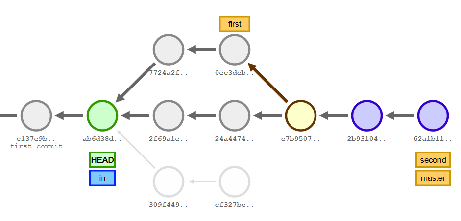
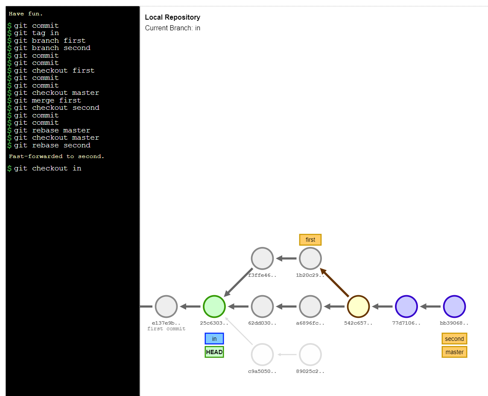
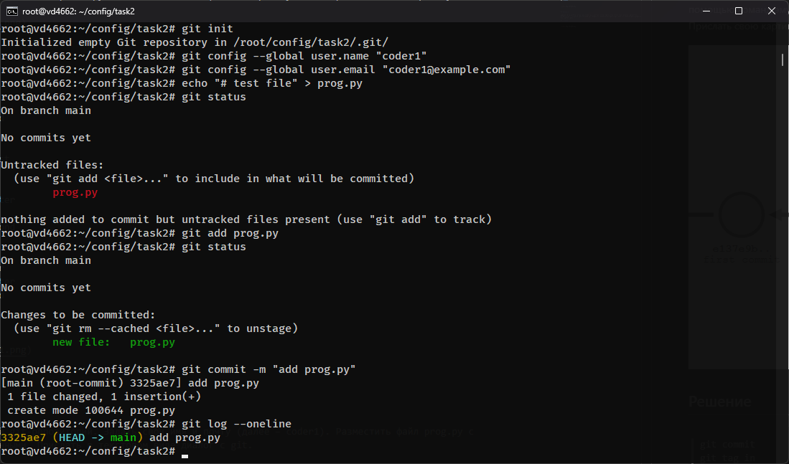

# Практическое задание №4. Системы контроля версий

П.Н. Советов, РТУ МИРЭА

Работа с Git.

## Задача 1

На сайте https://onlywei.github.io/explain-git-with-d3 или http://git-school.github.io/visualizing-git/ (цвета могут отличаться, есть команды undo/redo) с помощью команд эмулятора git получить следующее состояние проекта (сливаем master с first, перебазируем second на master): см. картинку ниже. Прислать свою картинку.



## Решение
```
git commit
git tag in
git branch first
git branch second
git commit
git commit
git checkout first
git commit
git commit
git checkout master
git merge first
git checkout second
git commit
git commit
git rebase master
git checkout master
git rebase second
git checkout in
```


---


## Задача 2

Создать локальный git-репозиторий. Задать свои имя и почту (далее – coder1). Разместить файл prog.py с какими-нибудь данными. Прислать в текстовом виде диалог с git.

## Решение
```
root@vd4662:~/config/task2# git init
Initialized empty Git repository in /root/config/task2/.git/
root@vd4662:~/config/task2# git config --global user.name "coder1"
root@vd4662:~/config/task2# git config --global user.email "coder1@example.com"
root@vd4662:~/config/task2# echo "# test file" > prog.py
root@vd4662:~/config/task2# git status
On branch main

No commits yet

Untracked files:
  (use "git add <file>..." to include in what will be committed)
        prog.py

nothing added to commit but untracked files present (use "git add" to track)
root@vd4662:~/config/task2# git add prog.py
root@vd4662:~/config/task2# git status
On branch main

No commits yet

Changes to be committed:
  (use "git rm --cached <file>..." to unstage)
        new file:   prog.py

root@vd4662:~/config/task2# git commit -m "add prog.py"
[main (root-commit) 3325ae7] add prog.py
 1 file changed, 1 insertion(+)
 create mode 100644 prog.py
root@vd4662:~/config/task2# git log --oneline
3325ae7 (HEAD -> main) add prog.py
root@vd4662:~/config/task2#
```


---


## Задача 3

Создать рядом с локальным репозиторием bare-репозиторий с именем server. Загрузить туда содержимое локального репозитория. Команда git remote -v должна выдать информацию о server! Синхронизировать coder1 с server.

Клонировать репозиторий server в отдельной папке. Задать для работы с ним произвольные данные пользователя и почты (далее – coder2). Добавить файл readme.md с описанием программы. Обновить сервер.

Coder1 получает актуальные данные с сервера. Добавляет в readme в раздел об авторах свою информацию и обновляет сервер.

Coder2 добавляет в readme в раздел об авторах свою информацию и решает вопрос с конфликтами.

Прислать список набранных команд и содержимое git log.

Пример лога коммитов:

```
*   commit a457d748f0dab75b4c642e964172887de3ef4e3e
|\  Merge: 48ce283 d731ba8
| | Author: Coder 2 <coder2@corp.com>
| | Date:   Sun Oct 11 11:27:09 2020 +0300
| | 
| |     readme fix
| | 
| * commit d731ba84014d603384cc3287a8ea9062dbb92303
| | Author: Coder 1 <coder1@corp.com>
| | Date:   Sun Oct 11 11:22:52 2020 +0300
| | 
| |     coder 1 info
| | 
* | commit 48ce28336e6b3b983cbd6323500af8ec598626f1
|/  Author: Coder 2 <coder2@corp.com>
|   Date:   Sun Oct 11 11:24:00 2020 +0300
|   
|       coder 2 info
| 
* commit ba9dfe9cb24316694808a347e8c36f8383d81bbe
| Author: Coder 2 <coder2@corp.com>
| Date:   Sun Oct 11 11:21:26 2020 +0300
| 
|     docs
| 
* commit 227d84c89e60e09eebbce6c0b94b41004a4541a4
  Author: Coder 1 <coder1@corp.com>
  Date:   Sun Oct 11 11:11:46 2020 +0300
  
      first commit
```

## Решение
```
```


---


## Задача 4

Написать программу на Питоне (или другом ЯП), которая выводит список содержимого всех объектов репозитория. Воспользоваться командой "git cat-file -p". Идеальное решение – не использовать иных сторонних команд и библиотек для работы с git.

## Решение
```
```


