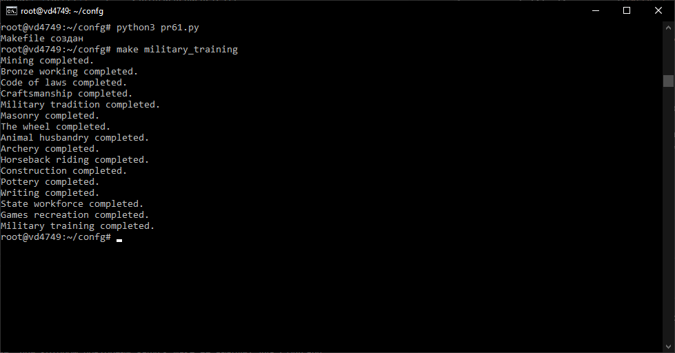
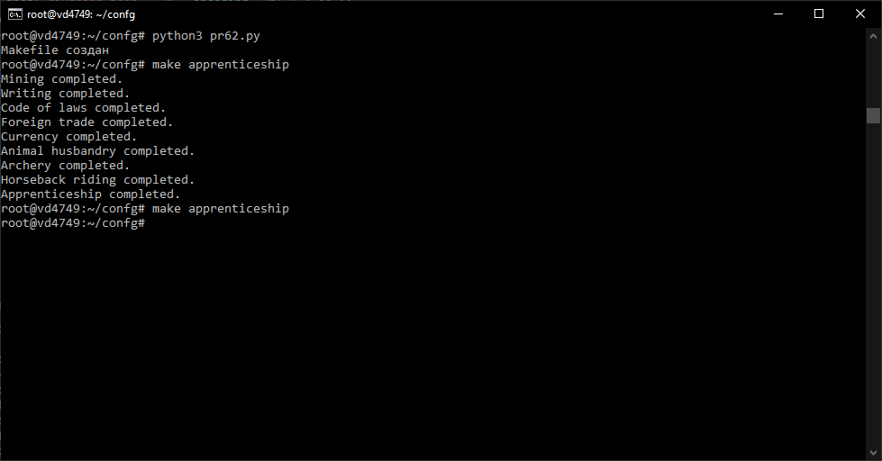
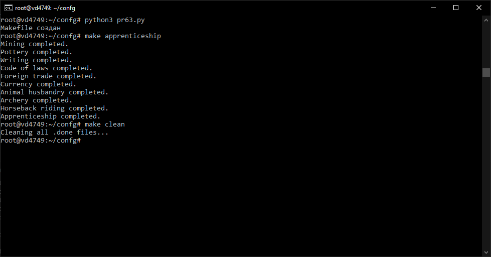
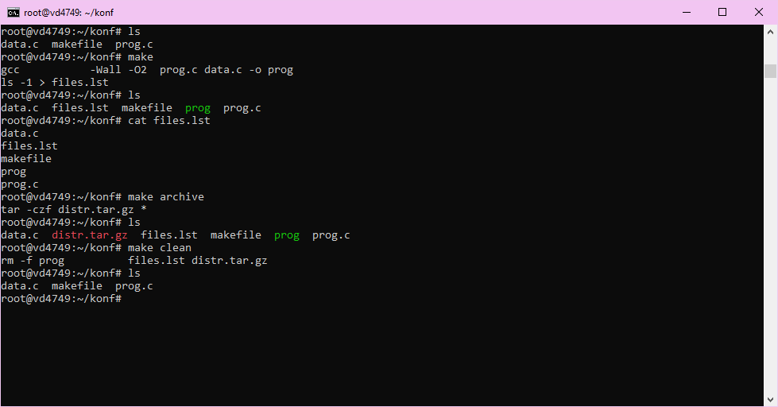

# Практическое задание №6. Системы автоматизации сборки

П.Н. Советов, РТУ МИРЭА

## Задача 1

Написать программу на Питоне, которая транслирует граф зависимостей civgraph в makefile в духе примера выше.
Пример:

```
> make mathematics
mining
bronze_working
sailing
astrology
celestial_navigation
pottery
writing
code_of_laws
foreign_trade
currency
irrigation
masonry
early_empire
mysticism
drama_poetry
mathematics
```

## Решение
```py
import json

def generate_makefile(civgraph):
    makefile_lines = []
    for target, dependencies in civgraph.items():
        if dependencies:
            makefile_lines.append(f"{target}: " + " ".join(dependencies))
        else:
            makefile_lines.append(f"{target}:")
        makefile_lines.append(f"\t@echo \"{target.replace('_', ' ').capitalize()} completed.\"")
        makefile_lines.append("")
    makefile_lines.insert(0, "all: " + " ".join(civgraph.keys()))
    return "\n".join(makefile_lines)


def main():
    with open("civgraph.json", "r", encoding="utf-8") as f:
        civgraph = json.load(f)
    makefile_content = generate_makefile(civgraph)
    with open("Makefile", "w", encoding="utf-8") as f:
        f.write(makefile_content)
    print("Makefile создан")

main()
```


---


## Задача 2

Реализовать вариант трансляции, при котором повторный запуск make не выводит для civgraph на экран уже выполненные "задачи".

## Решение
Измененная фу-я generate_makefile
```py
def generate_makefile(civgraph):
    makefile_lines = []
    for target, dependencies in civgraph.items():
        if dependencies:
            makefile_lines.append(f"{target}: " + " ".join(dependencies))
        else:
            makefile_lines.append(f"{target}:")
        makefile_lines.append(f"\t@if [ ! -f {target}.done ]; then \\")
        makefile_lines.append(f"\t\techo \"{target.replace('_', ' ').capitalize()} completed.\" && touch {target}.done; fi")
        makefile_lines.append("") 
    makefile_lines.insert(0, "all: " + " ".join(civgraph.keys()))
    return "\n".join(makefile_lines)
```


---


## Задача 3

Добавить цель clean, не забыв и про "животное".

## Решение
```py
def generate_makefile(civgraph):
    makefile_lines = []
    for target, dependencies in civgraph.items():
        if dependencies:
            makefile_lines.append(f"{target}: " + " ".join(dependencies))
        else:
            makefile_lines.append(f"{target}:")
        makefile_lines.append(f"\t@if [ ! -f {target}.done ]; then \\")
        makefile_lines.append(f"\t\techo \"{target.replace('_', ' ').capitalize()} completed.\" && touch {target}.done; fi")
        makefile_lines.append("") 
    makefile_lines.insert(0, "all: " + " ".join(civgraph.keys()))
    makefile_lines.append(".PHONY: all clean")
    makefile_lines.append("clean:")
    makefile_lines.append("\t@echo \"Cleaning all .done files...\"")
    makefile_lines.append("\t@rm -f *.done")
    return "\n".join(makefile_lines)
```


---


## Задача 4

Написать makefile для следующего скрипта сборки:

```
gcc prog.c data.c -o prog
dir /B > files.lst
7z a distr.zip *.*
```

Вместо gcc можно использовать другой компилятор командной строки, но на вход ему должны подаваться два модуля: prog и data.
Если используете не Windows, то исправьте вызовы команд на их эквиваленты из вашей ОС.
В makefile должны быть, как минимум, следующие задачи: all, clean, archive.
Обязательно покажите на примере, что уже сделанные подзадачи у вас не перестраиваются.

## Решение
```
```



